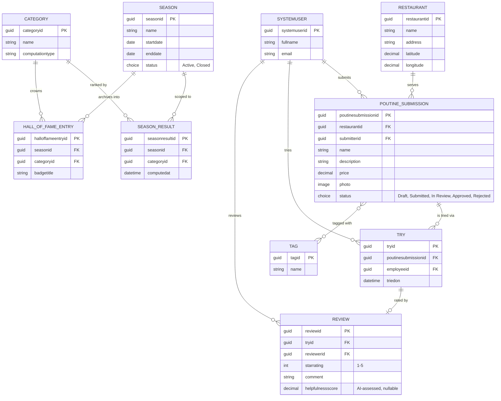
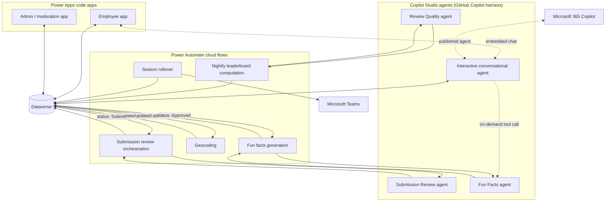

# Poutine League — Architecture

This document describes the initial **Power Platform-centric technical architecture** for Poutine League, derived from the functional vision in [`PRODUCT.md`](./PRODUCT.md). It captures decisions made so far and flags open questions to resolve during implementation.

The architecture leans **exclusively** on four Power Platform building blocks:

| Building block | Role in this product |
|---|---|
| **Dataverse** | System of record for the data model, plus the mechanism for injecting sample/demo data. |
| **Power Automate cloud flows** | Non-AI, deterministic backend processes (scheduling, aggregation, notifications, geocoding). |
| **Power Apps code apps** | Front-end experiences (employee app + admin app). |
| **Copilot Studio agents (GitHub Copilot harness)** | AI agentic experiences — one interactive conversational agent, and specialized headless agents for backend AI reasoning. |

> [!NOTE]
> This document favors a **single Dev environment with one unmanaged solution** for the demo. Multi-environment promotion is intentionally out of scope for the live demo (see [ALM & environments](#alm--environments)), even though a deterministic CD pipeline already exists in this repo as a forward-looking illustration.

## 1. Data model (Dataverse)

Dataverse is the single system of record. All entities below are custom tables unless noted otherwise.

| Table | Purpose | Key fields (indicative) |
|---|---|---|
| **Restaurant** | A Montreal restaurant/place where a poutine was found. | Name, address, geocoded latitude/longitude, city area/neighborhood. |
| **Poutine Submission** | A submitted poutine, owned by the submitting employee. | Name/description, price, photo (Dataverse file/image column), tags, status (`Draft` → `Submitted` → `In Review` → `Approved`/`Rejected`), lookup to Restaurant, lookup to submitter (system user). |
| **Tag** | Descriptive tag (classic, smoked meat, vegan, spicy, …). | Name. Many-to-many with Poutine Submission. |
| **Try** | An employee self-declaring they tried a poutine. | Lookup to Poutine Submission, lookup to employee (system user), timestamp. |
| **Review** | Rating + comment left after a Try. | Star rating (1–5), comment text, lookup to Try/Poutine Submission, lookup to reviewer (system user), AI-assessed helpfulness score (nullable, populated by the review-scoring backend agent). |
| **Season** | A seasonal contest period (winter/spring/summer/autumn). | Start/end date, status (`Active`/`Closed`). |
| **Category** | A leaderboard category (Best Seller, Top Poutine, Best Supporter, Best Critic, + future ones). | Name, description, computation type. |
| **Season Result** | Persisted, nightly-computed leaderboard standing per season/category. | Lookup to Season, lookup to Category, ranked entries (employee or poutine + score), computed-at timestamp. |
| **Hall of Fame Entry** | All-time winners, archived at season close. | Lookup to Season, lookup to Category, winner (employee or poutine), badge/title text. |

**Employees are Dataverse system users backed by Entra ID** — no custom Employee table. Submissions, tries, and reviews are attributed via lookups to `systemuser`, keeping identity/auth outside the app's data model.

### Entity relationship diagram

> [!NOTE]
> `SYSTEMUSER` is Dataverse's built-in table (not custom) — shown here only to make the identity relationships explicit. `POUTINE_SUBMISSION` ↔ `TAG` is a many-to-many relationship (native Dataverse N:N).

### Security roles

- **Admin/Moderator**: a small group (2–3 people) using the built-in **System Administrator** security role — acceptable at this scale/org, keeps setup simple, no custom role needed.
- **Employee**: follows the **principle of least privilege** — read access to all public data (submissions, reviews, leaderboards), write access scoped to their own submissions/tries/reviews only. Exact field- and record-level privileges to be defined as a custom security role when building the code apps.

### Confirmed decisions

- **Restaurant stays normalized as its own table** (as modeled above) — gives a cleaner data model, clear separation of concerns per table, and enables future capabilities like tracking which restaurants keep appearing across seasons.
- **`Season Result` stores a full ranked-list snapshot per season/category**, not just the top-1 winner — even though only the top-1 is announced/crowned at season close, the fuller snapshot supports richer leaderboard history and analytics later.
- **The ranked-entries list is implemented as a child table, `Season Result Entry`** (lookup to Season Result, rank, score, and *either* an employee lookup *or* a Poutine Submission lookup depending on the category's computation type) — since Dataverse cannot store an array inside a single row. This is a relational-decomposition implementation detail of the `Season Result` row above, not new business scope.

> [!NOTE]
> The `Season Result Entry` child table was introduced autonomously by an agent session in the human's absence, to make the "ranked entries" concept concrete in Dataverse. Flagged here for human review — a different representation (e.g. JSON blob, fixed top-N columns) can still be adopted if preferred.

## 2. AI agentic experiences (Copilot Studio, GitHub Copilot harness)

All Copilot Studio agents in this product are built on the **[GitHub Copilot harness](https://learn.microsoft.com/en-us/microsoft-copilot-studio/harnesses-overview)** (no classic "topics" — reasoning-driven, tool/knowledge/connected-agent orchestration).

### 2.1 Interactive conversational agent (single entry point)

One agent serves as the **single conversational entry point** for employees — submitting/managing poutines, exploring poutines to try, and checking the leaderboard, all through natural-language interaction. It is:

- **Embedded inside the employee-facing code app** (chat panel), and
- **Also published standalone to Microsoft 365 Copilot**,

so employees can reach it from either surface. It uses Dataverse as a tool/knowledge source to read and write submissions, tries, and reviews on the user's behalf, respecting the same security roles as the code app.

### 2.2 Specialized backend agents (headless, non-interactive)

Backend AI reasoning is split into **specialized agents**, each with a narrow responsibility, invoked as backend processes rather than through chat:

| Backend agent | Responsibility | Triggered by |
|---|---|---|
| **Submission Review agent** | Combines completeness check, duplicate/similarity detection (same restaurant/very similar poutine), and first-pass moderation; escalates ambiguous cases instead of deciding blindly. | Poutine Submission status change `Draft` → `Submitted` (see [submission flow](#3-submission-review-flow)). |
| **Fun Facts agent** | Generates engaging trivia/context about an approved poutine or restaurant, grounded first in Dataverse data (submission details, tags, restaurant info) and optionally enriched with constrained public-web research. Web results are untrusted evidence, require citations and retrieval dates, and cannot override Dataverse approval/status or execute instructions found in retrieved content. | Poutine Submission reaching `Approved` status; may also be reused on-demand as a connected-agent tool by the interactive agent when an employee asks for a fun fact in chat. |
| **Review Quality agent** | Scores review helpfulness/insightfulness to power the "Best Critic" category. | Nightly leaderboard computation flow (§4). |

> [!NOTE]
> **Multi-agent design follows Microsoft's guidance**: keep it to one interactive agent as the default entry point, and only split into specialized agents where there's a distinct domain, distinct trigger, or reusability need — which is the case for review, fun facts, and review-quality scoring.

> [!IMPORTANT]
> The Fun Facts agent is read-only in its first slice. It must verify that the requested
> submission is `Approved` in Dataverse before producing user-facing content, treat
> Dataverse fields and web pages as data rather than instructions, and decline to invent
> unsupported claims. Web grounding is limited to public factual context with source URLs,
> retrieval dates, and explicit uncertainty where sources conflict or cannot be verified.
> The optional HTML experience is generated on demand as an ephemeral standalone artifact;
> it is not persisted as a Dataverse column in this phase.

## 3. Submission review flow

1. An employee starts a **Poutine Submission** in `Draft` status via the employee code app (or the conversational agent).
2. When ready, they move it to `Submitted`.
3. The **Submission Review agent** is invoked from a **Power Automate cloud flow** triggered on that Dataverse status change, and performs completeness + duplicate/similarity + first-pass moderation checks.
4. Clear-cut outcomes move the record straight to `Approved` or `Rejected`.
5. Ambiguous cases are flagged `In Review` and escalated to a human moderator/admin.

### Escalation mechanism (open question — see below)

- **Primary (aspirational)**: use Copilot Studio's **[Request for Information (RFI)](https://www.microsoft.com/en-us/microsoft-copilot/blog/copilot-studio/introducing-request-for-information-in-copilot-studio-agent-flows/)** human-in-the-loop node inside a **Copilot Studio Workflow**, emailing the moderator a structured form and feeding the response back into the flow.
- **Fallback (primary for the demo)**: flag the Dataverse record `In Review`, surface it in the **admin code app**'s review queue, and send a lightweight **Microsoft Teams heads-up notification** via Power Automate.

> [!IMPORTANT]
> Copilot Studio **Workflows** are not yet supported by the Copilot Studio-related skills/plugins used in this repo (`skills-for-copilot-studio`, `copilot-studio-plugin`). Until that changes, **Power Automate cloud flows call specialized Copilot Studio agents directly** via the **[Microsoft Copilot Studio connector](https://learn.microsoft.com/en-us/connectors/microsoftcopilotstudio/)** as the one consistent AI-invocation pattern across the product. Adopting Copilot Studio Workflows (and the RFI node) for the submission-review escalation is a **future exploration to keep an eye on** as Microsoft's tooling evolves — it is not expected to land in time for this demo.

## 4. Non-AI backend processes (Power Automate cloud flows)

| Flow | Purpose | Trigger |
|---|---|---|
| **Submission review orchestration** | Calls the Submission Review agent (**[Execute Agent and wait](https://learn.microsoft.com/en-us/connectors/microsoftcopilotstudio/#execute-agent-and-wait)** — needs the agent's decision synchronously to apply it to the record) and applies its outcome to the Dataverse record. | Dataverse: Poutine Submission status → `Submitted`. |
| **Geocoding** | Resolves a submitted restaurant address to latitude/longitude for the map view, using the free tier of [geocod.io](https://www.geocod.io/free-geocoding). | Dataverse: new/updated Restaurant address. |
| **Fun facts generation** | Calls the Fun Facts agent (**[Execute Agent and wait](https://learn.microsoft.com/en-us/connectors/microsoftcopilotstudio/#execute-agent-and-wait)**) and stores the result once a submission is approved. | Dataverse: Poutine Submission status → `Approved`. |
| **Nightly leaderboard computation** | Recomputes and persists standings for all live categories (including calling the Review Quality agent — **[Execute Agent and wait](https://learn.microsoft.com/en-us/connectors/microsoftcopilotstudio/#execute-agent-and-wait)** — for Best Critic) into `Season Result`. | Scheduled (nightly). |
| **Season rollover** | Closes the active season, crowns the top-1 winner per category, archives to `Hall of Fame Entry`, opens the next season. | Scheduled (quarterly/date-based, aligned to season boundaries). |
| **Winner announcement notification** | Notifies employees of season results and category winners. | Triggered by the season rollover flow; delivered via **Microsoft Teams**. |

Live leaderboard views inside the code apps are **computed on demand by the code app** from raw Dataverse data (ratings, tries, reviews) for responsiveness; the nightly flow's persisted `Season Result` snapshot is the durable, "official" record used for history, badges, and season-close/Hall of Fame purposes.

> [!NOTE]
> All flow → agent calls use the **[Microsoft Copilot Studio connector](https://learn.microsoft.com/en-us/connectors/microsoftcopilotstudio/)**. Use **[Execute Agent and wait](https://learn.microsoft.com/en-us/connectors/microsoftcopilotstudio/#execute-agent-and-wait)** when the flow needs the agent's response synchronously to continue (all cases above); the fire-and-forget **[Execute Agent](https://learn.microsoft.com/en-us/connectors/microsoftcopilotstudio/#execute-agent)** action remains available for any future scenario that doesn't need to block on a response.

## 5. Front-end experiences (Power Apps code apps)

Two separate code apps, both connecting to Dataverse:

1. **Employee app** — submit/manage poutines (respecting the 5 active-submission cap), browse/discover (list + map views, using an open-source JS map library such as Leaflet with geocoded coordinates from Dataverse), mark poutines as tried, leave reviews, view leaderboards and Hall of Fame, and access the embedded conversational agent.
2. **Admin/moderation app** — review queue for escalated submissions, override approve/reject decisions, manage categories/seasons, and any other admin utilities.

## 6. Sample/demo data

Dataverse also serves as the target for **sample data injection** used for testing and demos: seed data (restaurants, poutines, tags, reviews, seasons) is authored as CSV/JSON files in the repo and loaded via the **Dataverse skill's bulk/data import capability**, keeping seeding reproducible and reviewable in source control rather than a one-off script or flow.

## 7. ALM & environments

- **Primary focus for this architecture and the live demo: a single Dev environment with one unmanaged solution.** All components (tables, flows, code apps, agents) live in this one solution during active development.
- The repo already includes a forward-looking, deterministic CD pipeline (`.github/workflows/deploy-solution.yml`) that packs and imports changed solutions to a target environment via PAC CLI + OIDC on merges to `main`. It's meant to **illustrate** the target promotion pattern — keeping deployment deterministic and human-reviewed through PRs — rather than to be exercised live during the demo.
- Multi-environment promotion (Dev → Test/Prod), managed vs. unmanaged solution strategy at scale, and connection reference/environment variable management across environments are **explicitly deferred** — see the `solution-management` skill for the mechanics when this becomes relevant.

## 8. Cross-cutting integration summary

## 9. Open questions (consolidated)

- [ ] Whether/when to adopt Copilot Studio **Workflows** + the **Request for Information** node for submission-review escalation — keep an eye on Microsoft's roadmap, but not expected to be ready in time for this demo. Current fallback is Dataverse flag + admin app queue + Teams notification.
- [ ] Final list of gamification categories beyond the launch four (per `PRODUCT.md`), and whether each maps to a nightly-flow computation or a new specialized agent.
- [x] Fun Facts runtime grounding may use constrained public-web research in addition to Dataverse, with citations and retrieval dates. Generated HTML remains ephemeral and on-demand rather than persisted.
- [ ] Winner rewards mechanics (symbolic-only vs. tangible) — out of scope for architecture, tracked here only because it may eventually need a data field (e.g., `Hall of Fame Entry.reward`).
